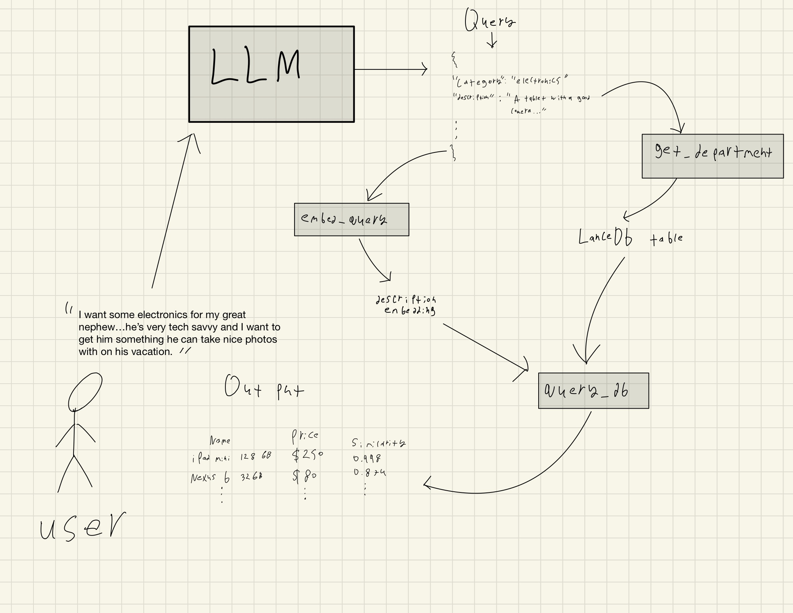

# general-store-RAG

## Quick Setup
In order to install the correct dependencies and the database, run the following code. I would recommend using a python venv with Python 3.11, or 3.12. Other versions should work, but these were what I used to test it. There is type hinting so at least Python 3.10 is required.<br>

### Setting up a venv


#### On Mac/Linux:

``` bash
python -m venv myenv
source myenv/bin/activate
```

#### On Windows:

``` powershell
python -m venv myenv 
myenv\Scripts\activate
```

### Installing Dependencies and Populating Vector Database
In order to install the required Python packages, setup the .env folder, and run the builder script for the vector db, execute the following code into your terminal:
```
touch .env 
pip install --upgrade pip 
pip install -r requirements.txt  
python build_database/build_vector_db.py
```
From there, the open ai api keys need to be added to the .env file.
After that, the tests and the app can be ran using
```bash
 python -m unittest discover 
 python main.py
 ```

<br>The tests should come back all passing.


## Usage
With the setup completed, to run the RAG execute `python main.py`s in the project root directory.

## Testing
In order to run the unit tests, execute <code>python -m unittest discover</code> in the project root directory.

## Components 
For this app, there are 3 main components that interact.

### 1. The Database 
The LanceDB database lives in the <code>general_store_db</code> directory in the projects root folder. This contains all the items for the general store and is divided up into three main tables, each representing their own department (food, electronics, and pet supplies). <br>
In order for this database to be populated, <code>build_vector_db.py</code> must be run <strong>from the project's root directory.</strong> If it's run from the <code>build_database</code> directory, it will exist inside that directory and <code>main.py</code> will error. 
<br>
The databse is built off of product metadata that is stored in <code>product_meta_data.py</code> as an array of dicts. (I understand this is not realistic, but for the scope of this project I deemed it a necessary shortcut). When the databse is being built, all existing tables will be dropped. The metadata will be imported, and each products description will be embedded with a sentence transformer and the vector stores alongside the product. These will be written to the <code>general_store_db</code> directory, and the food, electronics, and pet supplies will all be added to their own respective tables.
</li>

### 2. The RAG
The RAG is implemented within the `query_utils.py`.  
To better understand the RAG process and visualize the flow, refer to the following diagram: *(apologies for the hand-drawn diagram)*  



The user input is taken and parsed into the LLM. The LLM is prompted to return only a **JSON string** with relevant properties for filtering and retrieving from the database. The JSON, when parsed into a dictionary, is referred to as the **"query"** in the code. These include:  
- **Min and max price**  
- **The department** (referred to in the code as "category")  
- **The query to embed** (referred to as the "description" in the code)  
- Other relevant fields.  

The LLM function `query_LLM` parses and returns this dictionary, or `None` if the LLM fails to return valid JSON.  
If I were to spend more time on this, I would use **LangChain** to handle this more elegantly. The **temperature** of the prompt is kept low to reduce the probability of irrelevant details and to keep the queries focused on the product.

From there:  
1. The description is embedded.  
2. The department is extracted.  
3. With the description embedding as the **query**, the relevant department table in the database is searched using **cosine similarity**.  
   - All embeddings (both in the database and the query) are normalized for optimal performance.  
4. Relevant filters (e.g., price and quantity) are applied.  
5. A Pandas DataFrame is returned, ready to be displayed to the user.  


### 3. Main
 The main is compartively straightforward. It prints some ASCII art and has a while True loop for prompting the user, calling the RAG, and printing out the results. In case there is an error due to the LLM returning invalid JSON, this is caught and the loop continues. The relevant items are printed out to the user using the pandas dataframe <code>head()</code> method.
</ol>
